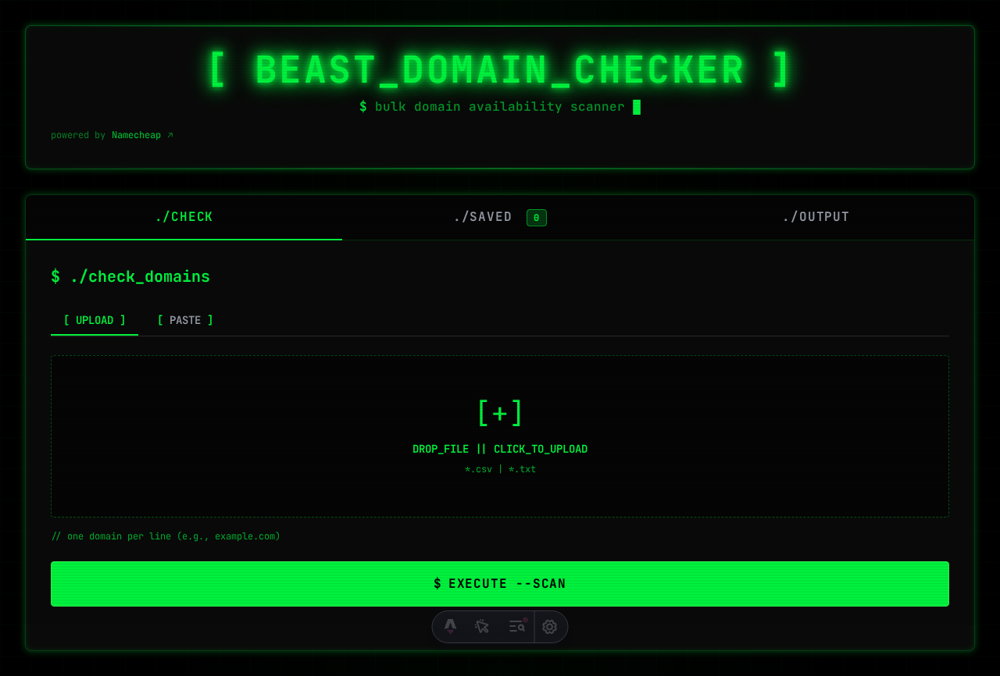

# Beast Domain Checker

A fast, beautiful bulk domain availability checker powered by Namecheap Beast Mode automation.




## Features

- **Bulk Checking** - Check up to 1000 domains at once
- **Multiple Input Methods** - Upload CSV/TXT or paste directly
- **Favorites System** - Save domains with prices for later
- **Export Results** - Download as CSV
- **Real-time Stats** - See available, taken, and premium counts
- **Modern UI** - Dark theme with gradient accents

## Quick Start

```bash
# Clone the repository
git clone https://github.com/YOUR_USERNAME/beast-domain-checker.git
cd beast-domain-checker

# Install dependencies
npm install

# Install Playwright browser
npx playwright install chromium

# Start development server
npm run dev
```

Open [http://localhost:6006](http://localhost:6006) in your browser.

## Usage

### Upload File

Create a CSV or TXT file with one domain per line:

```
example.com
mysite.dev
awesome.io
```

### Paste Domains

Paste domains directly in the textarea, one per line.

### Save Favorites

Click "Add to Favorites" on any result to save it for later.

## Project Structure

```
beast-domain-checker/
├── src/
│   ├── lib/
│   │   ├── domainChecker.ts   # Playwright automation
│   │   ├── csvParser.ts       # File parsing
│   │   └── storage.ts         # Data persistence
│   ├── pages/
│   │   ├── index.astro        # Main UI
│   │   └── api/
│   │       ├── check-domains.ts
│   │       └── favorites.ts
│   └── styles/
│       └── global.css
├── public/
├── astro.config.mjs
├── tailwind.config.mjs
└── package.json
```

## Tech Stack

- [Astro](https://astro.build) - Web framework
- [Playwright](https://playwright.dev) - Browser automation
- [Tailwind CSS](https://tailwindcss.com) - Styling
- [TypeScript](https://typescriptlang.org) - Type safety

## Configuration

### Port

Edit `astro.config.mjs` to change the default port (6006):

```js
export default defineConfig({
  server: { port: 3000 }
});
```

## Scripts

| Command | Description |
|---------|-------------|
| `npm run dev` | Start development server |
| `npm run build` | Build for production |
| `npm run preview` | Preview production build |

## Contributing

Contributions are welcome! See [CONTRIBUTING.md](CONTRIBUTING.md) for guidelines.

## License

[MIT](LICENSE)

## Disclaimer

This tool automates Namecheap's Beast Mode for domain checking. Use responsibly and in accordance with Namecheap's terms of service.
