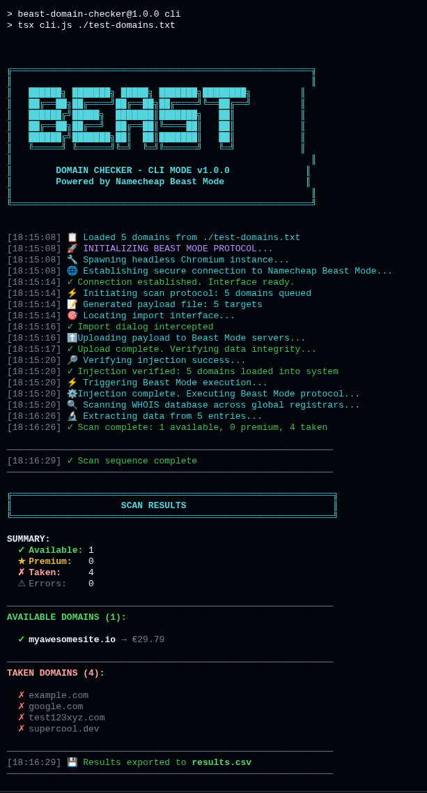

# Beast Domain Checker

A fast, beautiful bulk domain availability checker powered by Namecheap Beast Mode automation using Puppeteer.


## Features

- **Bulk Checking** - Check up to 1000 domains at once
- **Multiple Input Methods** - Upload CSV/TXT or paste directly
- **Favorites System** - Save domains with prices for later
- **Export Results** - Download as CSV
- **Real-time Stats** - See available, taken, and premium counts
- **Modern UI** - Dark theme with gradient accents

## Quick Start

### 🚀 Production Deployment

**For cloud deployment (Vercel, Railway, Render, etc.), see [DEPLOYMENT.md](./DEPLOYMENT.md)**

⚠️ **Important:** Vercel deployment requires Pro plan ($20/mo) for extended function timeout.

### Docker Compose (Recommended for Self-Hosting)

```bash
git clone https://github.com/YOUR_USERNAME/beast-domain-checker.git
cd beast-domain-checker
docker compose up -d
```

### Docker

```bash
# Build image
docker build -t beast-domain-checker .

# Run container
docker run -d -p 6006:6006 --name beast-domain-checker beast-domain-checker

# Stop container
docker stop beast-domain-checker

# Remove container
docker rm beast-domain-checker
```

Open [http://localhost:6006](http://localhost:6006) in your browser.

### Manual Installation

```bash
# Install dependencies (Puppeteer will download Chromium automatically)
npm install

# Start development server
npm run dev
```

> **Note:** Puppeteer automatically downloads a compatible Chromium browser during `npm install`. No additional installation steps required!

## Usage

### Web Interface

#### Upload File

Create a CSV or TXT file with one domain per line:

```
example.com
mysite.dev
awesome.io
```

#### Paste Domains

Paste domains directly in the textarea, one per line.

#### Save Favorites

Click "Add to Favorites" on any result to save it for later.

### CLI Mode

Check domains directly from the command line with hacker-style real-time logging!

#### Installation

```bash
# Clone and install dependencies
git clone <your-repo-url>
cd beast-domain-checker
npm install
```

#### Usage

**Option 1: Check from a file**
```bash
npm run cli domains.txt
```

Create `domains.txt` with one domain per line:
```
example.com
mysite.dev
awesome.io
```

**Option 2: Check domains directly**
```bash
npm run cli -- --domains example.com test.dev awesome.io
```

**Option 3: Custom output file**
```bash
npm run cli domains.txt --output my-results.csv
```

**Show help:**
```bash
npm run cli -- --help
```

#### CLI Features

- 🎨 **ASCII Art Banner** - Beautiful BEAST logo on startup
- 🚀 **Real-Time Hacker Logs** - Watch the scan progress with tactical messages
- 🎯 **Color-Coded Output** - Green (available), Yellow (premium), Red (taken)
- ⚡ **Fast Automation** - Headless Chromium with Puppeteer
- 💾 **Auto CSV Export** - Results saved automatically to `results.csv`
- 📊 **Detailed Statistics** - Summary with available/premium/taken counts
- 🔍 **Full Transparency** - See every step: connection, upload, scan, extraction

#### Example Output



Real-time hacker-style logs with color-coded output:

```
╔═══════════════════════════════════════════════════════╗
║        DOMAIN CHECKER - CLI MODE v1.0.0              ║
║        Powered by Namecheap Beast Mode               ║
╚═══════════════════════════════════════════════════════╝

[18:04:35] 📋 Loaded 5 domains from domains.txt
[18:04:35] 🚀 INITIALIZING BEAST MODE PROTOCOL...
[18:04:35] 🔧 Spawning headless Chromium instance...
[18:04:41] ✓ Connection established. Interface ready.
[18:04:41] ⚡ Initiating scan protocol: 5 domains queued
[18:04:43] ✓ Import dialog intercepted
[18:04:44] ✓ Upload complete. Verifying data integrity...
[18:04:47] ✓ Injection verified: 5 domains loaded into system
[18:04:47] ⚙️ Injection complete. Executing Beast Mode protocol...
[18:04:47] 🔍 Scanning WHOIS database across global registrars...
[18:05:54] 🔬 Extracting data from 5 entries...
[18:05:54] ✓ Scan complete: 1 available, 0 premium, 4 taken

RESULTS SUMMARY:
  ✓ Available: 1
  ★ Premium:   0
  ✗ Taken:     4
  ⚠ Errors:    0

AVAILABLE DOMAINS:
  ✓ myawesomesite.io (€29.79)

💾 Results saved to results.csv
```

#### Supported File Formats

- **TXT** - One domain per line
- **CSV** - One domain per line (automatically detected)

#### Notes

- Maximum 1000 domains per run
- Processing time: ~1-2 minutes for 100 domains
- Results exported to `results.csv` by default
- Lines starting with `#` are treated as comments

## Project Structure

```
beast-domain-checker/
├── src/
│   ├── lib/
│   │   ├── domainChecker.ts   # Puppeteer automation
│   │   ├── csvParser.ts       # File parsing
│   │   └── storage.ts         # Data persistence
│   ├── pages/
│   │   ├── index.astro        # Main UI
│   │   └── api/
│   │       ├── check-domains.ts
│   │       └── favorites.ts
│   └── styles/
│       └── global.css
├── public/
├── Dockerfile                 # Docker image definition
├── docker-compose.yml         # Docker Compose configuration
├── astro.config.mjs
├── tailwind.config.mjs
└── package.json
```

## Tech Stack

- [Astro](https://astro.build) - Web framework
- [Puppeteer](https://pptr.dev) - Headless Chrome automation
- [Tailwind CSS](https://tailwindcss.com) - Styling
- [TypeScript](https://typescriptlang.org) - Type safety
- [Docker](https://docker.com) - Containerization

## Configuration

### Port

Edit `astro.config.mjs` to change the default port (6006):

```js
export default defineConfig({
  server: { port: 3000 }
});
```

## Scripts

| Command | Description |
|---------|-------------|
| `npm run dev` | Start development server |
| `npm run build` | Build for production |
| `npm run preview` | Preview production build |

## Contributing

Contributions are welcome! See [CONTRIBUTING.md](CONTRIBUTING.md) for guidelines.

## License

[MIT](LICENSE)

## Disclaimer

This tool automates Namecheap's Beast Mode for domain checking. Use responsibly and in accordance with Namecheap's terms of service.
